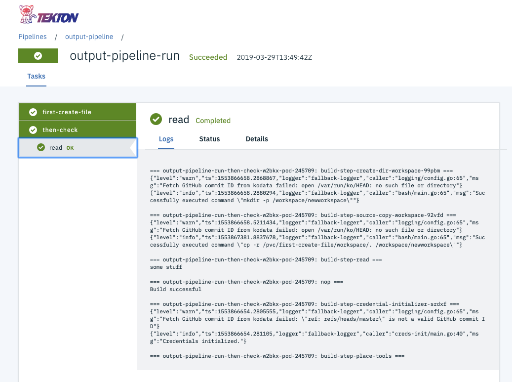

# Tekton Dashboard

Tekton Dashboard is a general purpose, web-based UI for [Tekton Pipelines](https://github.com/tektoncd/pipeline) and [Tekton triggers](https://github.com/tektoncd/triggers) resources.

It allows users to manage and view Tekton resource creation, execution, and completion.

Among other things, the Tekton Dashboard supports:
- Filtering resources by label
- Realtime view of PipelineRun and TaskRun logs
- View resource details and YAML
- Show resources for the whole cluster or limit visibility to a particular namespace
- Import resources directly from a git repository
- Adding functionality through extensions, like automatically triggering pipelines on git events (GitHub and GitLab supported)

## Start using Tekton Dashboard

- Tekton Dashboard [install](./docs/install.md)
- Tekton Dashboard [extensions overview](./docs/extensions.md)
- Try out the [katacoda tutorial](https://katacoda.com/tektoncd/scenarios/tekton-dashboard)
- Take a look at our [roadmap](./roadmap.md)
- Try our [walk-throughs](./docs/walkthrough/README.md)
- Feature requests and bug reports welcome, please [open an issue](https://github.com/tektoncd/dashboard/issues/new/choose)

## Which version should I use?

| Version | Docs | Pipelines | Triggers |
| ------- | ---- | --------- | -------- |
| [HEAD](./DEVELOPMENT.md) | [Docs @ HEAD](./docs/README.md) | v0.11.x - v0.18.x | v0.5.x - 0.9.x |
| [v0.11.1](https://github.com/tektoncd/dashboard/releases/tag/v0.11.1) | [Docs @ v0.11.1](https://github.com/tektoncd/dashboard/tree/v0.11.1/docs) | v0.11.x - v0.18.x | v0.5.x - 0.9.x |
| [v0.10.2](https://github.com/tektoncd/dashboard/releases/tag/v0.10.2) | [Docs @ v0.10.2](https://github.com/tektoncd/dashboard/tree/v0.10.2/docs) | v0.11.x - v0.17.x | v0.5.x - 0.9.x |
| [v0.9.0](https://github.com/tektoncd/dashboard/releases/tag/v0.9.0) | [Docs @ v0.9.0](https://github.com/tektoncd/dashboard/tree/v0.9.0/docs) | v0.11.x - v0.15.x | v0.5.x - 0.7.x |
| [v0.8.2](https://github.com/tektoncd/dashboard/releases/tag/v0.8.2) | [Docs @ v0.8.2](https://github.com/tektoncd/dashboard/tree/v0.8.2/docs) | v0.11.x - v0.14.x | v0.5.x - 0.6.x |
| [v0.7.1](https://github.com/tektoncd/dashboard/releases/tag/v0.7.1) | [Docs @ v0.7.1](https://github.com/tektoncd/dashboard/tree/v0.7.1/docs) | v0.11.x - v0.13.x | v0.5.x - 0.6.x |
| [v0.6.1.5](https://github.com/tektoncd/dashboard/releases/tag/v0.6.1.5) | [Docs @ v0.6.1.5](https://github.com/tektoncd/dashboard/tree/v0.6.1.5/docs) | v0.11.x - v0.12.x | v0.4.x |

  
Other versions

  It is **strongly recommended** to use the **v0.6.1.4** release or newer for Tekton Pipelines v0.11.x and v0.12.x and Tekton Triggers v0.4.
  - This is a **critically important security release**
  - Earlier versions are deprecated and should be used for **development or isolated usage only**

  | Version | Docs | Pipelines | Triggers |
  | ------- | ---- | --------- | -------- |
  | [v0.11.0](https://github.com/tektoncd/dashboard/releases/tag/v0.11.0) | [Docs @ v0.11.0](https://github.com/tektoncd/dashboard/tree/v0.11.0/docs) | v0.11.x - v0.18.x | v0.5.x - 0.9.x |
  | [v0.10.1](https://github.com/tektoncd/dashboard/releases/tag/v0.10.1) | [Docs @ v0.10.1](https://github.com/tektoncd/dashboard/tree/v0.10.1/docs) | v0.11.x - v0.17.x | v0.5.x - 0.8.x |
  | [v0.10.0](https://github.com/tektoncd/dashboard/releases/tag/v0.10.0) | [Docs @ v0.10.0](https://github.com/tektoncd/dashboard/tree/v0.10.0/docs) | v0.11.x - v0.17.x | v0.5.x - 0.8.x |
  | [v0.8.0](https://github.com/tektoncd/dashboard/releases/tag/v0.8.0) | [Docs @ v0.8.0](https://github.com/tektoncd/dashboard/tree/v0.8.0/docs) | v0.11.x - v0.14.x | v0.5.x - 0.6.x |
  | [v0.7.0](https://github.com/tektoncd/dashboard/releases/tag/v0.7.0) | [Docs @ v0.7.0](https://github.com/tektoncd/dashboard/tree/v0.7.0/docs) | v0.11.x - v0.13.x | v0.4.x - 0.5.x |
  | [v0.6.1.4](https://github.com/tektoncd/dashboard/releases/tag/v0.6.1.4) | [Docs @ v0.6.1.4](https://github.com/tektoncd/dashboard/tree/v0.6.1.4/docs) | v0.11.x | v0.4.x |
  | [v0.6.0](https://github.com/tektoncd/dashboard/releases/tag/v0.6.0) | | v0.11.x | v0.3.x |
  | [v0.5.3](https://github.com/tektoncd/dashboard/releases/tag/v0.5.3) | | v0.10.x | v0.3.x |
  | [v0.5.2](https://github.com/tektoncd/dashboard/releases/tag/v0.5.2) | | v0.10.x | v0.2.x |
  | [v0.5.0](https://github.com/tektoncd/dashboard/releases/tag/v0.5.0) | | v0.10.x | v0.1 |
  | [v0.4.1](https://github.com/tektoncd/dashboard/releases/tag/v0.4.1) | | v0.8.0 | v0.1 |
  | [v0.3.0](https://github.com/tektoncd/dashboard/releases/tag/v0.3.0) | | v0.8.0 | v0.1 |
  | [v0.2.1](https://github.com/tektoncd/dashboard/releases/tag/v0.2.1) | | v0.7.0 | |
  | [v0.1.1](https://github.com/tektoncd/dashboard/releases/tag/v0.1.1) | | v0.5.2 | |

## Browser support

The Tekton Dashboard has been tested on modern evergreen browsers.

It generally supports the current and previous stable versions of:

- Google Chrome (Windows, macOS, Linux)
- Mozilla Firefox (Windows, macOS, Linux)
- Apple Safari (macOS)
- Microsoft Edge (Windows)

Older versions or other browsers may work, but some features may be missing or not function as expected.

## Want to contribute

We are so excited to have you !

- See [CONTRIBUTING.md](./CONTRIBUTING.md) for an overview of our processes
- See [DEVELOPMENT.md](./DEVELOPMENT.md) for how to get started
- Look at our
  [good first issues](https://github.com/tektoncd/dashboard/issues?q=is%3Aissue+is%3Aopen+label%3A%22good+first+issue%22)
  and our
  [help wanted issues](https://github.com/tektoncd/dashboard/issues?q=is%3Aissue+is%3Aopen+label%3A%22help+wanted%22)

---

Except as otherwise noted, the content of this page is licensed under the [Creative Commons Attribution 4.0 License](https://creativecommons.org/licenses/by/4.0/).

Code samples are licensed under the [Apache 2.0 License](https://www.apache.org/licenses/LICENSE-2.0).
