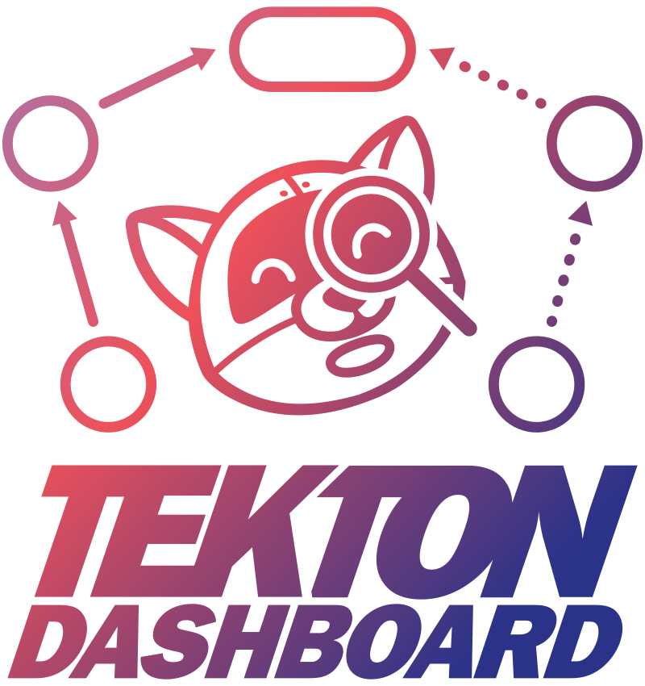
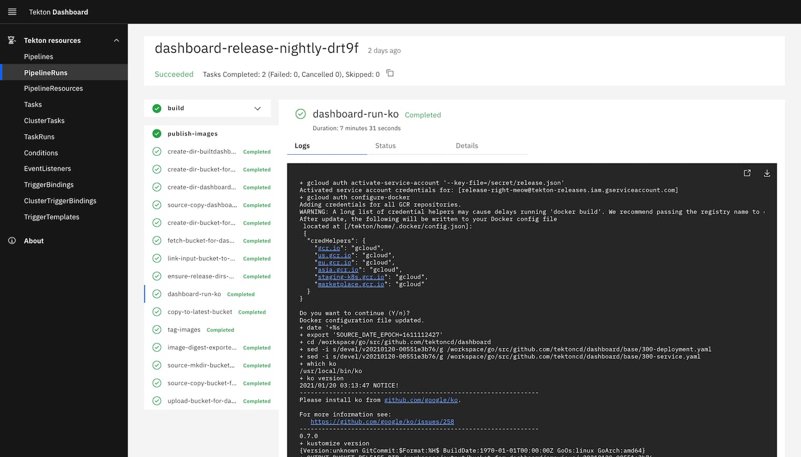

<!--

---
title: Dashboard
linkTitle: Dashboard
weight: 6
description: >
  Web-based UI for Tekton Pipelines and Tekton Triggers resources
cascade:
  github_project_repo: https://github.com/tektoncd/dashboard
---

-->

# Tekton Dashboard

  

Tekton Dashboard is a general purpose, web-based UI for [Tekton Pipelines](https://github.com/tektoncd/pipeline) and [Tekton Triggers](https://github.com/tektoncd/triggers) resources.

It allows users to manage and view Tekton resource creation, execution, and completion.

Some of the features the Tekton Dashboard supports:
- Realtime view of `PipelineRun` and `TaskRun` status and logs
- Filter resources by label
- View resource overview and YAML
- Show resources for the whole cluster or limit visibility to a particular namespace
- Import resources directly from a git repository
- Add functionality through extensions

## Read the docs

- [Installing Tekton Dashboard](./install.md)
- Jump in with [the "Getting started" tutorial!](./tutorial.md)
- Take a look at our [roadmap](https://github.com/tektoncd/dashboard/blob/main/roadmap.md)
- Discover our [releases](https://github.com/tektoncd/dashboard/blob/main/releases.md)
- Try our [walk-throughs](./walkthrough/README.md) for more details on deploying and configuring the Tekton Dashboard for some common scenarios
- Learn how to add additional resource types to the Tekton Dashboard using [extensions](./extensions.md)

Version specific links are available in the [releases](https://github.com/tektoncd/dashboard/blob/main/releases.md) page and on the
[Tekton website](https://tekton.dev/docs).

## Browser support

The Tekton Dashboard has been tested on modern evergreen browsers.

It generally supports the current and previous stable versions of:

- Google Chrome (Windows, macOS, Linux)
- Mozilla Firefox (Windows, macOS, Linux)
- Apple Safari (macOS)
- Microsoft Edge (Windows)

Older versions or other browsers may work, but some features may be missing or not function as expected.

## Want to contribute

We are so excited to have you!

- Feature requests and bug reports welcome, please [open an issue](https://github.com/tektoncd/dashboard/issues/new/choose)
- See [CONTRIBUTING.md](https://github.com/tektoncd/dashboard/blob/main/CONTRIBUTING.md) for an overview of our processes
- See [DEVELOPMENT.md](https://github.com/tektoncd/dashboard/blob/main/DEVELOPMENT.md) for how to get started
- Look at our
  [good first issues](https://github.com/tektoncd/dashboard/issues?q=is%3Aissue+is%3Aopen+label%3A%22good+first+issue%22)
  and our
  [help wanted issues](https://github.com/tektoncd/dashboard/issues?q=is%3Aissue+is%3Aopen+label%3A%22help+wanted%22)

---

Except as otherwise noted, the content of this page is licensed under the [Creative Commons Attribution 4.0 License](https://creativecommons.org/licenses/by/4.0/). Code samples are licensed under the [Apache 2.0 License](https://www.apache.org/licenses/LICENSE-2.0).
