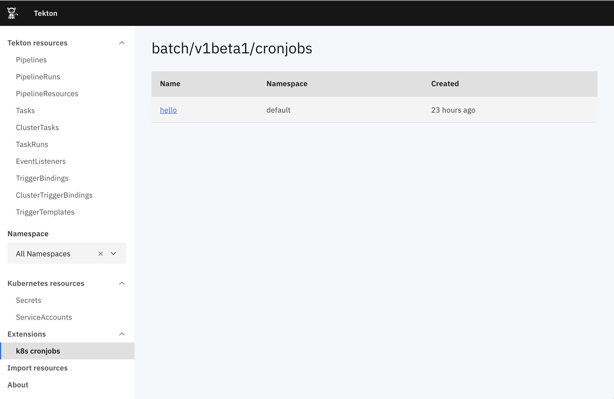

# Tekton Dashboard extensions

This guide explains what Tekton Dashboard extensions are and how to manage them. It covers the following topics:

- [Before you begin](#before-you-begin)
- [Resource based extensions](#resource-based-extensions)
   - [Extension CRD (apiVersion: dashboard.tekton.dev/v1alpha1)](#extension-crd-apiversion-dashboardtektondevv1alpha1)
   - [Example: Register a CronJob extension](#example-register-a-cronjob-extension)
   - [Example: Extend Tekton Dashboard service account permissions](#example-extend-tekton-dashboard-service-account-permissions)

## Before you begin

Tekton Dashboard Extensions are currently alpha and are considered experimental. This means things could change at any time.

## Resource based extensions

Resource based extensions provide a simple and easy way to list and view resources inside a cluster. They are deployed as `Extension` resources and the Dashboard will generate UI to display the chosen resources.

Using them requires two steps (see an example below):
1. create an [Extension resource](#extension-crd-apiversion-dashboardtektondevv1alpha1) in your cluster
1. add RBAC rules to the Tekton Dashboard service account to allow it access to the target resources

See the [Example: Register a CronJob extension](#example-register-a-cronjob-extension) below for a working example.

### Extension CRD (apiVersion: dashboard.tekton.dev/v1alpha1)

#### Extension

| Variable Name | Type                            | Required | Default | Description                      |
|---------------|---------------------------------|----------|---------|----------------------------------|
|               | metav1.TypeMeta                 | Yes      | -       |                                  |
| metadata      | metav1.ObjectMeta               | No       | -       |                                  |
| spec          | [ExtensionSpec](#extensionspec) | Yes      | -       | Extension spec                   |

#### ExtensionSpec

| Variable Name | Type              | Required | Default | Description                                                      |
|---------------|-------------------|----------|---------|------------------------------------------------------------------|
| apiVersion    | string            | Yes      | -       | Extension resource group                                         |
| name          | string            | Yes      | -       | Extension resource name                                          |
| displayname   | string            | Yes      | -       | Display name in the Dashboard UI                                 |
| namespaced    | boolean           | No       | true    | Specifies whether the Extension represents a namespaced resource |

### Example: Register a CronJob extension

To create an `Extension` resource for `CronJob`s run the following command:

```bash
kubectl apply -n tekton-pipelines -f - <<EOF
apiVersion: dashboard.tekton.dev/v1alpha1
kind: Extension
metadata:
  name: cronjobs
spec:
  apiVersion: batch/v1beta1
  name: cronjobs
  displayname: k8s cronjobs
EOF
```

This adds a new item in the side nav of the Dashboard.

Clicking on it will show an error though, you need to allow the Tekton Dashboard service account to access cronjobs in your cluster. See [next step](#example-extend-tekton-dashboard-service-account-permissions) to learn how you can easily extend RBAC rules of the service account.

### Example: Extend Tekton Dashboard service account permissions

Extending the Tekton Dashboard service account can be done easily using [ClusterRole aggregation](https://kubernetes.io/docs/reference/access-authn-authz/rbac/#aggregated-clusterroles). To support this method the Dashboard must be installed with the `--extensions-rbac` flag to ensure that the aggregationRule is correctly configured.

Create a `ClusterRole` with the necessary permissions and the label `rbac.dashboard.tekton.dev/aggregate-to-dashboard: "true"`.

To add the necessary permissions for your cronjobs extension to work, run the following command:

```bash
kubectl apply -f - <<EOF
kind: ClusterRole
apiVersion: rbac.authorization.k8s.io/v1
metadata:
  name: tekton-dashboard-cronjobs-extension
  labels:
    rbac.dashboard.tekton.dev/aggregate-to-dashboard: "true"
rules:
  - apiGroups: ["batch"]
    resources: ["cronjobs"]
    verbs: ["get", "list"]
EOF
```

Alternatively, if the `--extensions-rbac` is not used, omit the label from the ClusterRole, and define the appropriate RoleBinding or ClusterRoleBinding yourself with the subject set to the `tekton-dashboard` service account.

Now the Tekton Dashboard will show `CronJob`s in your cluster.



---

Except as otherwise noted, the content of this page is licensed under the [Creative Commons Attribution 4.0 License](https://creativecommons.org/licenses/by/4.0/).

Code samples are licensed under the [Apache 2.0 License](https://www.apache.org/licenses/LICENSE-2.0).
