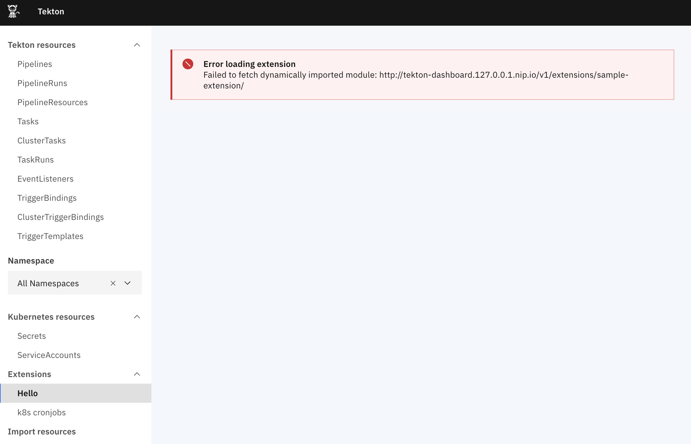
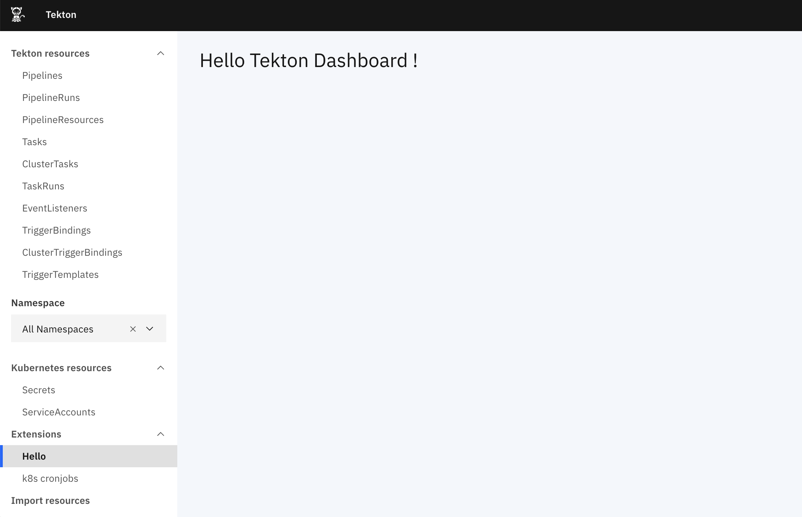

# Tekton Dashboard extensions

This guide explains what Tekton Dashboard extensions are and how to manage them. It covers the following topics:

- [Before you begin](#before-you-begin)
- [Resource based extensions](#resource-based-extensions)
   - [Extension CRD (apiVersion: dashboard.tekton.dev/v1alpha1)](#extension-crd-apiversion-dashboardtektondevv1alpha1)
   - [Example: Register a CronJob extension](#example-register-a-cronjob-extension)
   - [Example: Extend Tekton Dashboard service account permissions](#example-extend-tekton-dashboard-service-account-permissions)
- [Service based extensions](#service-based-extensions)
   - [Example: Create a simple nodejs backend](#example-create-a-simple-nodejs-backend)
   - [Example: Add and serve frontend code](#example-add-and-serve-frontend-code)
- [Next steps](#next-steps)

## Before you begin

Tekton Dashboard Extensions should be considered alpha and are highly experimental. This means things could change at any time.

There are two types of extension supported by the Tekton Dashboard:
- [Resource based extensions](#resource-based-extensions) are deployed as `Extension` resources,
the Dashboard will adapt itself to display the registered resource extensions on the frontend
- [Service based extensions](#service-based-extensions) are deployed as independent services in the cluster,
the Dashboard automatically recognizes thoses services, injects the frontend code in the web UI and proxies calls to the backend extension service

Resource based extensions are more limited than service based extensions, they provide a simple and easy way to list and view resources inside a cluster.
Service based extensions are much more powerful but require more work to develop.

An example of a complete service based extension is the [webhooks-extension](https://github.com/tektoncd/experimental/tree/master/webhooks-extension).

## Resource based extensions

Resource based extensions provide a simple and easy way to list and view resources inside a cluster.

Using them requires two steps (see an example below):
1. You will need to create an [Extension resource](#extension-crd-apiversion-dashboardtektondevv1alpha1) in your cluster to let the Tekton Dashboard know that it should display additional Kubernetes resources
1. You will need to add RBAC rules to the Tekton Dashboard service account to allow it access to the target resources

See the [Example: Register a CronJob extension](#example-register-a-cronjob-extension) below for a working example.

### Extension CRD (apiVersion: dashboard.tekton.dev/v1alpha1)

#### Extension

| Variable Name | Type                            | Required | Default | Description                      |
|---------------|---------------------------------|----------|---------|----------------------------------|
|               | metav1.TypeMeta                 | Yes      | -       |                                  |
| metadata      | metav1.ObjectMeta               | No       | -       |                                  |
| spec          | [ExtensionSpec](#extensionspec) | Yes      | -       | Extension spec                   |

#### ExtensionSpec

| Variable Name | Type              | Required | Default | Description                                                      |
|---------------|-------------------|----------|---------|------------------------------------------------------------------|
| apiVersion    | string            | Yes      | -       | Extension resource group                                         |
| name          | string            | Yes      | -       | Extension resource name                                          |
| displayname   | string            | Yes      | -       | Display name in the Dashboard UI                                 |
| namespaced    | boolean           | No       | true    | Specifies whether the Extension represents a namespaced resource |

### Example: Register a CronJob extension

To create an `Extension` resource for `CronJob`s run the following command:

```bash
kubectl apply -n tekton-pipelines -f - <<EOF
apiVersion: dashboard.tekton.dev/v1alpha1
kind: Extension
metadata:
  name: cronjobs
spec:
  apiVersion: batch/v1beta1
  name: cronjobs
  displayname: k8s cronjobs
EOF
```

This will add a new item in the side nav of the dashboard.

Clicking on it will show an error though, you need to allow the Tekton Dashboard service account to access cronjobs in your cluster. See [next step](#example-extend-tekton-dashboard-service-account-permissions) to learn how you can easily extend RBAC rules of the service account.

### Example: Extend Tekton Dashboard service account permissions

Extending the Tekton Dashboard service account can be done easily using [ClusterRole aggregation](https://kubernetes.io/docs/reference/access-authn-authz/rbac/#aggregated-clusterroles).

Simply create a `ClusterRole` with the necessary permissions and add the `rbac.dashboard.tekton.dev/aggregate-to-dashboard: "true"` label to it.

To add the necessary permissions for your cronjobs extension to work, run the following command:

```bash
kubectl apply -f - <<EOF
kind: ClusterRole
apiVersion: rbac.authorization.k8s.io/v1
metadata:
  name: tekton-dashboard-cronjobs-extension
  labels:
    rbac.dashboard.tekton.dev/aggregate-to-dashboard: "true"
rules:
  - apiGroups: ["batch"]
    resources: ["cronjobs"]
    verbs: ["get", "list"]
EOF
```

Now the Tekton Dashboard should be able to show `CronJob`s in your cluster.


## Service based extensions

Service based extensions are more powerful tools, they let you write your custom backend and frontend code.

The frontend code will be dynamically loaded by the Tekton Dashboard at runtime, the backend code can expose an API that will be proxied by the Dashboard backend.

This takes more work to develop but allows for feature rich extensions.

To create such an extension you will need to deploy a `Service` in your cluster, this service will serve frontend code and host the backend API.
You will also need to add a well-known label `tekton-dashboard-extension: "true"` to let the Dashboard know about it.

Well-known annotations are used to describe inner workings of the extension:
- `tekton-dashboard-display-name` is the display name of your extension to appear in the side nav
- `tekton-dashboard-endpoints` registers the list of endpoints exposed by the backend API
- `tekton-dashboard-bundle-location` tells the Tekton Dashboard where to load the frontend code

Additionally, the Tekton Dashboard host will globally expose a few objects to let the extension's frontend code connect to these shared components (you can view the list of shared objects [here](../src/containers/Extension/globals.js)).

Follow the [next steps](#example-create-a-simple-nodejs-backend) to learn how to develop a simple service based extension.
You can also look at the [webhooks-extension](https://github.com/tektoncd/experimental/tree/master/webhooks-extension) to learn more about service based extensions.

### Example: Create a simple nodejs backend

To begin, you will create a simple Node.js backend, deploy it in a pod and expose it through a service that will be detected by the Tekton Dashboard.

```bash
kubectl apply -n tekton-pipelines -f - <<EOF
kind: Service
apiVersion: v1
metadata:
  name: sample-extension
  labels:
    app: sample-extension
    tekton-dashboard-extension: "true"
  annotations:
    tekton-dashboard-display-name: Hello
    tekton-dashboard-endpoints: sample
spec:
  ports:
  - port: 3000
    targetPort: 3000
  selector:
    app: sample-extension
---
apiVersion: apps/v1
kind: Deployment
metadata:
  name: sample-extension
  labels: 
    app: sample-extension
spec:
  replicas: 1
  selector:
    matchLabels:
      app: sample-extension
  template:
    metadata:
      labels:
        app: sample-extension
    spec:
      containers:
      - name: node
        image: node:latest
        ports:
        - containerPort: 3000
        command:
        - bash
        args:
        - -c
        - |
          cat <<EOF > server.js
          const express = require('express');
          const app = express();
          app.get('/sample', (req, res) => res.send('Hello Tekton Dashboard !'));
          app.listen(3000, '0.0.0.0');
          EOF
          npm install express
          node ./server.js
EOF
```

The command above does the following:
- create a deployment where the `express` web server is installed in a `nodejs` container
- start the web server and serve the `/sample` endpoint returning the `'Hello Tekton Dashboard !'` message when hit
- create a service exposing the deployment
  - the `tekton-dashboard-extension: "true"` label lets the Tekton Dashboard know about the service based extension
  - the  `tekton-dashboard-display-name: Hello` annotation make the extension appear in the side nav under the `Hello` name
  - the `tekton-dashboard-endpoints: sample` annotation allows proxying requests to the extension by the Tekton Dashboard

You can verify that the extension backend is working by hitting the path `/v1/extensions/sample-extension/sample`, it should display the `Hello Tekton Dashboard !` message.



The error message happens because the extension doesn't have frontend code yet, [next step](#example-add-and-serve-frontend-code) will guide you through adding frontend code to your extension.

### Example: Add and serve frontend code

The Tekton Dashboard is developed using [React](https://reactjs.org/), therefore the extension frontend code will need to use React too.

All you need to do is provide an ES module exporting your `Component`, this component will be loaded at runtime by the Tekton Dashboard host and injected into the page.

For this to work, you will need to create your component using the shared objects provided by the host, namely you won't `import React, { Component } from 'react';` but use `window.React` instead.
This can be done manually or using an ES module bundler such as [Rollup](https://rollupjs.org/) to transform your imports.

To deploy the service based extension with frontend code run the following command:

```bash
kubectl apply -n tekton-pipelines -f - <<EOF
kind: Service
apiVersion: v1
metadata:
  name: sample-extension
  labels:
    app: sample-extension
    tekton-dashboard-extension: "true"
  annotations:
    tekton-dashboard-display-name: Hello
    tekton-dashboard-endpoints: sample.bundle
    tekton-dashboard-bundle-location: bundle
spec:
  ports:
  - port: 3000
    targetPort: 3000
  selector:
    app: sample-extension
---
apiVersion: apps/v1
kind: Deployment
metadata:
  name: sample-extension
  labels: 
    app: sample-extension
spec:
  replicas: 1
  selector:
    matchLabels:
      app: sample-extension
  template:
    metadata:
      labels:
        app: sample-extension
    spec:
      containers:
      - name: node
        image: node:latest
        ports:
        - containerPort: 3000
        command:
        - bash
        args:
        - -c
        - |
          cat <<EOF > frontend.js
          const React = window.React;
          class Extension extends React.Component {
            state = {
              message: 'Loading ...'
            };
            componentDidMount() {
              fetch('/v1/extensions/sample-extension/sample')
                .then(response => response.text())
                .then(message => this.setState({ message }));
            };
            render() {
              const { message } = this.state;
              return React.createElement("h1", null, message);
            }
          }
          export default Extension;
          EOF
          cat <<EOF > server.js
          const express = require('express');
          const path = require('path');
          const app = express();
          app.get('/sample', (req, res) => res.send('Hello Tekton Dashboard !'));
          app.get('/bundle', (req, res) => res.sendFile(path.resolve(__dirname, './frontend.js')));
          app.listen(3000, '0.0.0.0');
          EOF
          npm install express
          node ./server.js
EOF
```

You can see from the code above that the `Service` annotations changed:
- `tekton-dashboard-endpoints: sample.bundle` means that both `sample` and `bundle` endpoints exist on the extension
- `tekton-dashboard-bundle-location: bundle` means that the frontend code will be loaded at the `/bundle` path

In the extension `Pod`, a new `frontend.js` file is generated containing the frontend code and the `/bundle` route is registered in the `express` server to serve the frontend js file.

**NOTE:** In a real extension the frontend code would be written and bundled separately, devs aren't expected to inline an ES module into the extension resource and are free to use additional libraries if they wish. The extension API only requires that they provide an ES module that exposes a React component for the Tekton Dashboard to load.

Once the extension frontend code is injected in the page, it will call `/sample` backend endpoint to fetch a message and will render the obtained message in the Dashboard UI.

The complete extension should look something like this:



## Next steps

You can install or learn more about service based extensions on the [webhooks-extension](https://github.com/tektoncd/experimental/tree/master/webhooks-extension) page.

---

Except as otherwise noted, the content of this page is licensed under the [Creative Commons Attribution 4.0 License](https://creativecommons.org/licenses/by/4.0/).

Code samples are licensed under the [Apache 2.0 License](https://www.apache.org/licenses/LICENSE-2.0).
