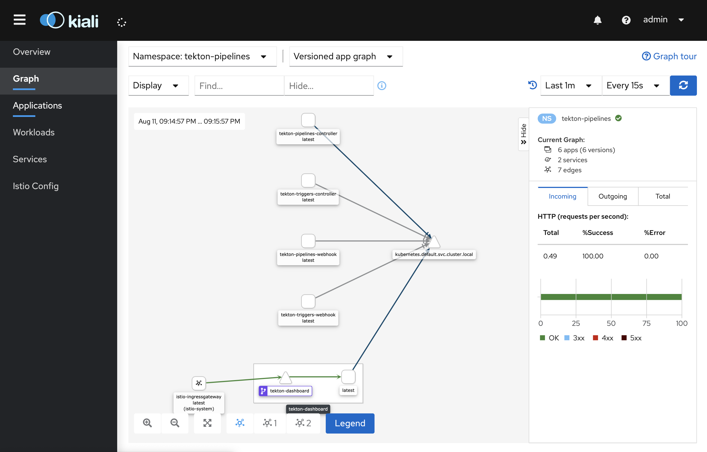

# Tekton Dashboard walkthrough - Kind and Istio

This guide walks you through installing a working Tekton Dashboard locally from scratch with Istio. It covers the following topics:

* [Before you begin](#before-you-begin)
* [Service mesh benefits](#service-mesh-benefits)
* [Creating a local Kubernetes cluster](#creating-a-local-kubernetes-cluster)
* [Installing the Istio operator](#installing-the-istio-operator)
* [Installing the Istio service mesh](#installing-the-istio-service-mesh)
* [Note on sidecar injection](#note-on-sidecar-injection)
* [Installing Tekton Pipelines](#installing-tekton-pipelines)
* [Installing Tekton Dashboard](#installing-tekton-dashboard)
* [Setting up the Istio Gateway and VirtualService](#setting-up-the-istio-gateway-and-virtualservice)
* [Browsing the Istio dashboard](#browsing-the-istio-dashboard)
* [Adding basic authentication](#adding-basic-authentication)
* [Cleaning up](#cleaning-up)

## Before you begin

Before you begin, make sure the following tools are installed:

1. [`kind`](https://kind.sigs.k8s.io): For creating a local cluster running on top of docker.
1. [`kubectl`](https://kubernetes.io/docs/tasks/tools/install-kubectl): For interacting with your Kubernetes cluster.
1. [`istioctl`](https://istio.io/latest/docs/setup/getting-started/#download): For installing Istio.
    - Version 1.7.0 is used in this walkthrough. Other version may not work as expected.
    - You can check your istioctl version with: `istioctl version`


Nothing more is required to run the walkthrough !

## Service mesh benefits

Using a service mesh brings benefits in several domains:
- security
- observability
- resiliency

Some security benefits:
- mutual TLS brings secure communications inside the cluster (encrypted and authenticated)
- egress control prevents data exfiltration and domains white list
- network policies allow to secure pod-to-pod or service-to-service communication at the network and application layers

Some observality benefits:
- understand how service performance impacts things upstream and downstream
- help detect and fix issues quickly and efficiently

Some resiliency benefits:
- automatically retry failed service calls
- mirror traffic to send a copy of live traffic to a mirrored service
- add circuit breakers directly on the wire
- inject network faults to test applications behaviour

The list is by no means exhaustive and service meshes bring a lot more benefits than just those enumerated above.

Visit [Istio's webpage](https://istio.io/latest/docs/concepts/what-is-istio/) or [Istio's blog](https://istio.io/latest/blog) for more info.

## Creating a local Kubernetes cluster

The first thing to do is to create a Kubernetes cluster.

Kind is an easy solution to run a local cluster, all it needs is to have `docker` installed.

Create a cluster by running the following command:

```bash
kind create cluster --name walkthrough --config - <<EOF
kind: Cluster
apiVersion: kind.x-k8s.io/v1alpha4
nodes:
- role: control-plane
  extraPortMappings:
  - containerPort: 30080
    hostPort: 80
    protocol: TCP
  - containerPort: 30443
    hostPort: 443
    protocol: TCP
EOF
```

This will create a cluster with ports 80 and 443 exposed on the host computer. This is needed to communicate with the Istio ingress gateway.

Once the cluster is started, you can check that the context was added in your kubeconfig file by running:

```bash
kubectl config get-contexts
```

The output should look something like this:

```bash
CURRENT   NAME                                                 CLUSTER                          AUTHINFO                               NAMESPACE
*         kind-walkthrough                                     kind-walkthrough                 kind-walkthrough                       
```

The `kind-walkthrough` is the context for the cluster you just created and the `*` at the beginning means that it is the currently active context.

You can verify that the ports were correctly mapped by `docker` by running `docker ps`. The output should show something like this:

```bash
CONTAINER ID        IMAGE                  COMMAND                  CREATED              STATUS              PORTS                                                                      NAMES
084e58aa36fe        kindest/node:v1.17.0   "/usr/local/bin/entr…"   About a minute ago   Up 56 seconds       127.0.0.1:32778->6443/tcp, 0.0.0.0:80->30080/tcp, 0.0.0.0:443->30443/tcp   walkthrough-control-plane
```

## Installing the Istio operator

Now that the cluster is up and running, you will need to install istio.

Instead of installing Istio directly in the cluster, you will install the `istio-operator` then the operator will take care of installing the Istio service mesh inside the cluster.

Install `istio-operator` by running the following commands:

```bash
istioctl operator init
```

Once the command succeeds, the `istio-operator` should be running in the cluster.

## Installing the Istio service mesh

To install the Istio service mesh components you need to create an `IstioOperator` resource inside your cluster that describes the settings of the service mesh to be created by the `istio-operator`.

Run the following command to create a service mesh, exposing the ingress gateway through a `NodePort` service with http/https traffic coming on port 30080/30443:

```bash
kubectl create namespace istio-system

kubectl apply -f - <<EOF
apiVersion: install.istio.io/v1alpha1
kind: IstioOperator
metadata:
  namespace: istio-system
  name: istiocontrolplane
spec:
  profile: demo
  components:
    ingressGateways:
      - name: istio-ingressgateway
        enabled: true
        k8s:
          service:
            type: NodePort
            ports:
              - name: status-port
                port: 15021
                targetPort: 15021
              - name: http2
                port: 80
                nodePort: 30080
                targetPort: 8080
              - name: https
                port: 443
                nodePort: 30443
                targetPort: 8443
              - name: tls
                port: 15443
                targetPort: 15443
  addonComponents:
    prometheus:
      enabled: true
    kiali:
      enabled: true
    grafana:
      enabled: true
EOF
```

After a short delay, the service mesh pods should be up and running in the `istio-system` namespace, running the command `kubectl get pod -n istio-system` should display something similar to the following output:

```bash
NAME                                   READY   STATUS    RESTARTS   AGE
grafana-5dc4b4676c-vh9r6               1/1     Running   0          114s
istio-egressgateway-65d5579779-6sbpr   1/1     Running   0          2m
istio-ingressgateway-96f44fb4d-wwsq8   1/1     Running   0          2m
istio-tracing-8584b4d7f9-l7hnp         1/1     Running   0          114s
istiod-7988b4d788-2vq9k                1/1     Running   0          2m15s
kiali-6f457f5964-np7hf                 1/1     Running   0          114s
prometheus-67988db74f-2x2hb            2/2     Running   0          114s
```

## Note on sidecar injection

Istio supports two modes for injecting the service mesh proxy sidecar:
- manual injection with `istioctl kube-inject`
- automatic injection using a mutating webhook

In this walkthrough, the manual injection technique will be used.

You can turn on automatic sidecar injection by adding the `istio-injection=enabled` label on the `tekton-pipelines` namespace and restarting all pods once all Tekton components have been deployed:

```bash
kubectl label namespace tekton-pipelines istio-injection=enabled

kubectl delete pods --all -n tekton-pipelines
```

## Installing Tekton Pipelines

Tekton Dashboard requires to have Tekton Pipelines installed.

Installing the latest Tekton Pipelines release is done by running the following command:

```bash
curl -sL https://storage.googleapis.com/tekton-releases/pipeline/latest/release.yaml | istioctl kube-inject -f - | kubectl apply -f -

kubectl wait -n tekton-pipelines \
  --for=condition=ready pod \
  --selector=app.kubernetes.io/part-of=tekton-pipelines,app.kubernetes.io/component=controller \
  --timeout=90s
```

Tekton Pipelines should be up and running.

## Installing Tekton Dashboard

Installing the latest Tekton Dashboard release is done by running the following command:

```bash
curl -sL https://storage.googleapis.com/tekton-releases/dashboard/latest/tekton-dashboard-release.yaml | istioctl kube-inject -f - | kubectl apply -f -

kubectl wait -n tekton-pipelines \
  --for=condition=ready pod \
  --selector=app.kubernetes.io/part-of=tekton-dashboard,app.kubernetes.io/component=dashboard \
  --timeout=90s
```

Tekton Dashboard should be up and running.

## Setting up the Istio Gateway and VirtualService

To access the Dashboard through the ingress controller it is necessary to set up an ingress rule. The ingress rule maps a host name to the Tekton Dashboard service running inside the cluster.

For the sake of simplicity we will use the freely available [`nip.io`](https://nip.io/) service to construct a URL pointing to our local cluster.

Assuming the following url `http://tekton-dashboard.127.0.0.1.nip.io`, run the following command to create the Istio `Gateway` and `VirtualService` to expose the Dashboard:

```bash
kubectl apply -f - <<EOF
apiVersion: networking.istio.io/v1alpha3
kind: Gateway
metadata:
  namespace: tekton-pipelines
  name: tekton-dashboard
spec:
  selector:
    istio: ingressgateway
  servers:
    - port:
        number: 80
        name: http
        protocol: HTTP
      hosts:
        - tekton-dashboard.127.0.0.1.nip.io
---
apiVersion: networking.istio.io/v1alpha3
kind: VirtualService
metadata:
  namespace: tekton-pipelines
  name: tekton-dashboard
spec:
  hosts:
    - tekton-dashboard.127.0.0.1.nip.io
  gateways:
    - tekton-dashboard
  http:
    - route:
        - destination:
            host: tekton-dashboard
            port:
              number: 9097
EOF
```

Browse `http://tekton-dashboard.127.0.0.1.nip.io` to access your dashboard.

## Browsing the Istio dashboard

You can browse the Istio dashboard by running the following command:

```bash
istioctl dashboard kiali
```

Default install uses `admin`/`admin` for login and password.



## Adding basic authentication

One way of enabling basic authentication with Istio involves using an Envoy filter for a certain domain and path.

The `EnvoyFilter` below will secure all traffic coming to the Dashboard by adding basic authentication.

To deploy the filter, run the following command:

```bash
kubectl apply -f - <<EOF
apiVersion: networking.istio.io/v1alpha3
kind: EnvoyFilter
metadata:
  name: basic-auth-tekton-dashboard
  namespace: tekton-pipelines
spec:
  workloadSelector:
    labels:
      app: tekton-dashboard
  configPatches:
    # The first patch adds the lua filter to the listener/http connection manager
    - applyTo: HTTP_FILTER
      match:
        context: SIDECAR_INBOUND
        listener:
          portNumber: 9097
          filterChain:
            filter:
              name: "envoy.http_connection_manager"
              subFilter:
                name: "envoy.router"
      patch:
        operation: INSERT_BEFORE
        value: # lua filter specification
          name: envoy.lua
          typed_config:
            "@type": "type.googleapis.com/envoy.config.filter.http.lua.v2.Lua"
            inlineCode: |
              -- the following domain and path can be adjusted
              -- to be where the tekton dashboard resides
              local domain = "tekton-dashboard.127.0.0.1.nip.io"
              local path = "/"

              -- base64 encoded: <username>:<password>
              -- example: ok:test2
              -- Change it to whatever you would like
              local base64UsernamePassword = "Basic b2s6dGVzdDI=" 

              function string.starts(String,Start)
                return string.sub(String,1,string.len(Start))==Start
              end

              function envoy_on_request(request_handle)
                local host = request_handle:headers():get(":authority")
                local path = request_handle:headers():get(":path")
                if ( host ~= nil and host:lower() == domain )
                then
                  if ( path ~= nil and string.starts(path:lower(), path) )
                  then
                    if request_handle:headers():get("authorization") == base64UsernamePassword
                    then
                      return
                    end
                    request_handle:respond(
                      {[":status"] = "401", ["WWW-Authenticate"] = "Basic realm=\"Unknown\""}, "Unauthorized"
                    )
                  end
                end
              end
EOF
```

Now, visiting `http://tekton-dashboard.127.0.0.1.nip.io` should require a login / password, enter `ok` / `test2` to access the Dashboard.

## Cleaning up

To clean everything up, run the following command:

```bash
kind delete cluster --name walkthrough
```

---

Except as otherwise noted, the content of this page is licensed under the [Creative Commons Attribution 4.0 License](https://creativecommons.org/licenses/by/4.0/).

Code samples are licensed under the [Apache 2.0 License](https://www.apache.org/licenses/LICENSE-2.0).
