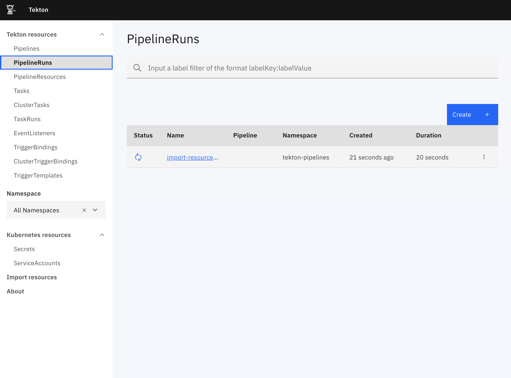
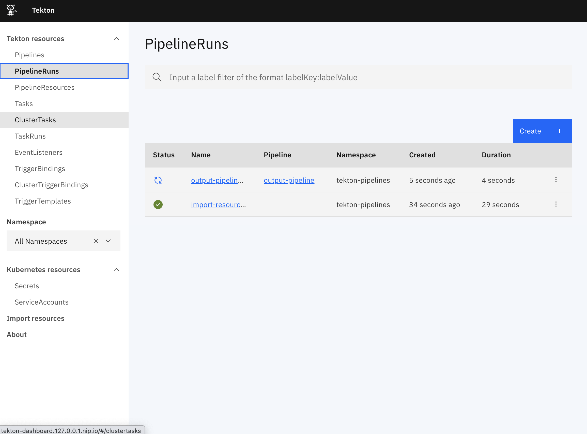

# Tekton Dashboard walkthrough - Kind

This guide walks you through installing a working Tekton Dashboard locally from scratch. It covers the following topics:

* [Before you begin](#before-you-begin)
* [Creating a local Kubernetes cluster](#creating-a-local-kubernetes-cluster)
* [Installing NGINX ingress controller](#installing-nginx-ingress-controller)
* [Installing Tekton Pipelines](#installing-tekton-pipelines)
* [Installing Tekton Triggers (optional)](#installing-tekton-triggers-optional)
* [Installing Tekton Dashboard](#installing-tekton-dashboard)
* [Setting up an Ingress rule to access the Dashboard](#setting-up-an-ingress-rule-to-access-the-dashboard)
* [Importing resources from a Github repository](#importing-resources-from-a-github-repository)
* [Viewing and managing resources from the Dashboard](#viewing-and-managing-resources-from-the-dashboard)
* [Cleaning up](#cleaning-up)

## Before you begin

Before you begin, make sure the following tools are installed:

1. [`kind`](https://kind.sigs.k8s.io/): For creating a local cluster running on top of docker.
1. [`kubectl`](https://kubernetes.io/docs/tasks/tools/install-kubectl/): For interacting with your kubernetes cluster.

Nothing more is required to run the walkthrough !

## Creating a local Kubernetes cluster

The first thing to do is to create a Kubernetes cluster.

Kind is an easy solution to run a local cluster, all it needs is to have `docker` installed.

Create a cluster by running the following command:

```bash
kind create cluster --name walkthrough --config - <<EOF
kind: Cluster
apiVersion: kind.x-k8s.io/v1alpha4
nodes:
- role: control-plane
  kubeadmConfigPatches:
  - |
    kind: InitConfiguration
    nodeRegistration:
      kubeletExtraArgs:
        node-labels: "ingress-ready=true"
  extraPortMappings:
  - containerPort: 80
    hostPort: 80
    protocol: TCP
  - containerPort: 443
    hostPort: 443
    protocol: TCP
EOF
```

This will create a cluster with ports 80 and 443 exposed on the host computer. This is needed to communicate with the ingress controller later when [Installing NGINX ingress controller](#installing-nginx-ingress-controller).

Once the cluster is started, you can check that the context was added in your kubeconfig file by running:

```bash
kubectl config get-contexts
```

The output looks something like this:

```bash
CURRENT   NAME                                                 CLUSTER                          AUTHINFO                               NAMESPACE
*         kind-walkthrough                                     kind-walkthrough                 kind-walkthrough                       
```

The `kind-walkthrough` is the context for the cluster you created and the `*` at the beginning means that it is the currently active context.

If it's not currently active you can run the following command to select it as the active cluster:

```
kubectl config use-context kind-walkthrough
```

You can verify that the ports were correctly mapped by `docker` by running `docker ps`. The output shows something like this:

```bash
CONTAINER ID        IMAGE                  COMMAND                  CREATED             STATUS             PORTS                                                                 NAMES
eaf0af7569e6        kindest/node:v1.17.0   "/usr/local/bin/entr…"   32 minutes ago      Up 32 minutes       0.0.0.0:80->80/tcp, 0.0.0.0:443->443/tcp, 127.0.0.1:32770->6443/tcp   walkthrough-control-plane
```

## Installing NGINX ingress controller

Now that the cluster is up and running, you will need to install an ingress controller to expose services running inside the cluster to the outside world.

The ingress controller used in this walkthrough is [ingress-nginx](https://github.com/kubernetes/ingress-nginx), see [Ingress Controllers](https://kubernetes.io/docs/concepts/services-networking/ingress-controllers/) for other available solutions.

Install nginx ingress controller by running the following commands:

```bash
kubectl apply -f https://raw.githubusercontent.com/kubernetes/ingress-nginx/controller-0.32.0/deploy/static/provider/kind/deploy.yaml

kubectl wait -n ingress-nginx \
  --for=condition=ready pod \
  --selector=app.kubernetes.io/component=controller \
  --timeout=90s
```

If the command exited successfully the ingress controller is now up and ready to process requests.

## Installing Tekton Pipelines

Tekton Dashboard requires to have Tekton Pipelines installed.

Installing the latest Tekton Pipelines release is done by running the following command:

```bash
kubectl apply --filename https://storage.googleapis.com/tekton-releases/pipeline/latest/release.yaml

kubectl wait -n tekton-pipelines \
  --for=condition=ready pod \
  --selector=app.kubernetes.io/part-of=tekton-pipelines,app.kubernetes.io/component=controller \
  --timeout=90s
```

## Installing Tekton Dashboard

Installing the latest Tekton Dashboard release is done by running the following command:

```bash
curl -sL https://raw.githubusercontent.com/tektoncd/dashboard/main/scripts/release-installer | \
   bash -s -- install latest

kubectl wait -n tekton-pipelines \
  --for=condition=ready pod \
  --selector=app.kubernetes.io/part-of=tekton-dashboard,app.kubernetes.io/component=dashboard \
  --timeout=90s
```

## Setting up an Ingress rule to access the Dashboard

To access the Dashboard through the ingress controller it is necessary to set up an ingress rule. The ingress rule maps a host name to the Tekton Dashboard service running inside the cluster.

For the sake of simplicity we will use the freely available [`nip.io`](https://nip.io/) service to construct a URL pointing to our local cluster.

Assuming the following url `http://tekton-dashboard.127.0.0.1.nip.io`, run the following command to create the ingress rule:

```bash
kubectl apply -n tekton-pipelines -f - <<EOF
apiVersion: networking.k8s.io/v1
kind: Ingress
metadata:
  name: tekton-dashboard
spec:
  rules:
  - host: tekton-dashboard.127.0.0.1.nip.io
    http:
      paths:
      - pathType: ImplementationSpecific
        backend:
          service:
            name: tekton-dashboard
            port:
              number: 9097
EOF
```

Browse `http://tekton-dashboard.127.0.0.1.nip.io` to access your dashboard.

**NOTE:** If accessing the dashboard via the URL does not work, ensure that you have no other processes using port 80, e.g. nginx.

**NOTE:** Alternatively you can use the `--ingress-url` argument when invoking the `installer` script to create the `Ingress` resource:

```bash
curl -sL https://raw.githubusercontent.com/tektoncd/dashboard/main/scripts/release-installer | \
   bash -s -- install latest --ingress-url tekton-dashboard.127.0.0.1.nip.io

kubectl wait -n tekton-pipelines \
  --for=condition=ready pod \
  --selector=app.kubernetes.io/part-of=tekton-dashboard,app.kubernetes.io/component=dashboard \
  --timeout=90s
```

## Importing resources from a Github repository

The Tekton Dashboard can import resources directly from a GitHub repository.

The following steps demonstrate how to import a set of resources from a file hosted in a GitHub repository and view the resulting `PipelineRun`. The example contains some `Tasks`, a `Pipeline` that uses them, and a `PipelineRun` to execute it. To learn more about what the example does, take a look at the [example file](https://github.com/tektoncd/pipeline/blob/main/examples/v1beta1/pipelineruns/output-pipelinerun.yaml) we'll be using.

Open `http://tekton-dashboard.127.0.0.1.nip.io/#/importresources` and fill in the form:

- **Repository URL**: https://github.com/tektoncd/pipeline
- **Repository directory**: examples/v1beta1/pipelineruns/output-pipelinerun.yaml
- **Target namespace**: tekton-pipelines
- **Namespace**: tekton-pipelines
- **ServiceAccount**: tekton-dashboard

Then click the **Import and Apply** button to launch the importing `PipelineRun`.

You will see a `PipelineRun` running when looking at the PipelineRuns page (`http://tekton-dashboard.127.0.0.1.nip.io/#/pipelineruns`), this is the `PipelineRun` responsible for importing the resources from the GitHub repository.



## Viewing and managing resources from the Dashboard

You can view resource lists, individual resource details, `PipelineRun` and `TaskRun` logs, start new `PipelineRuns` or `TaskRuns`, delete resources, etc...



## Cleaning up

To clean everything up, run the following command:

```bash
kind delete cluster --name walkthrough
```

---

Except as otherwise noted, the content of this page is licensed under the [Creative Commons Attribution 4.0 License](https://creativecommons.org/licenses/by/4.0/).

Code samples are licensed under the [Apache 2.0 License](https://www.apache.org/licenses/LICENSE-2.0).