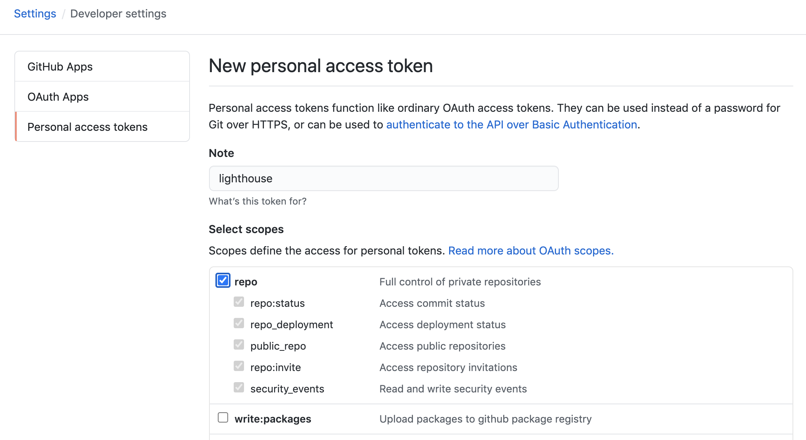
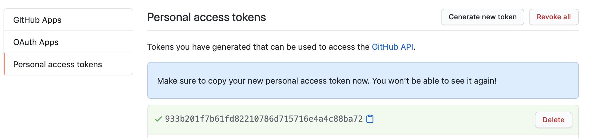
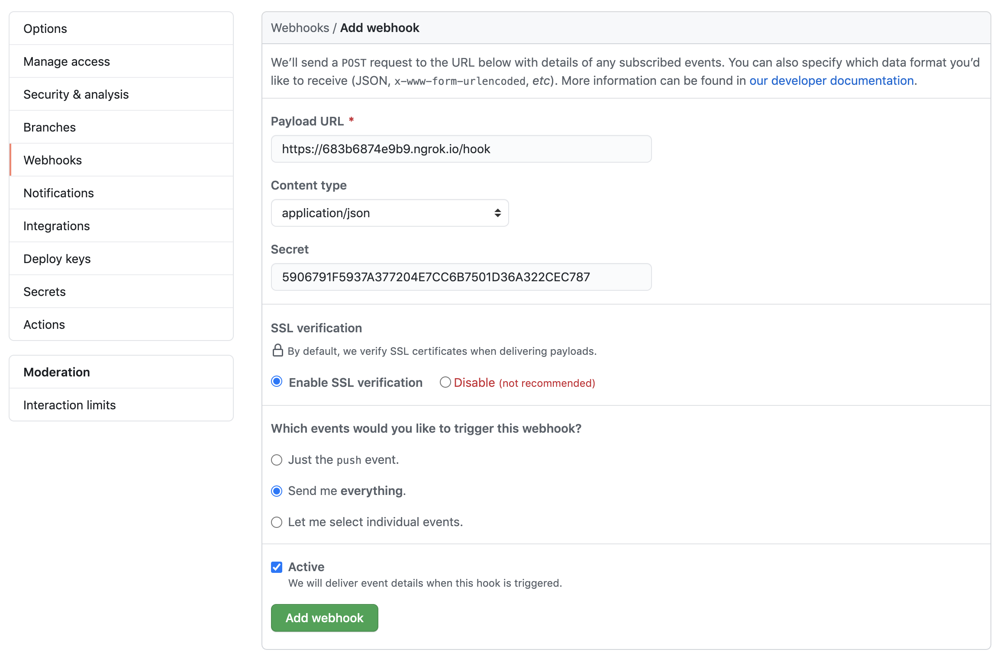
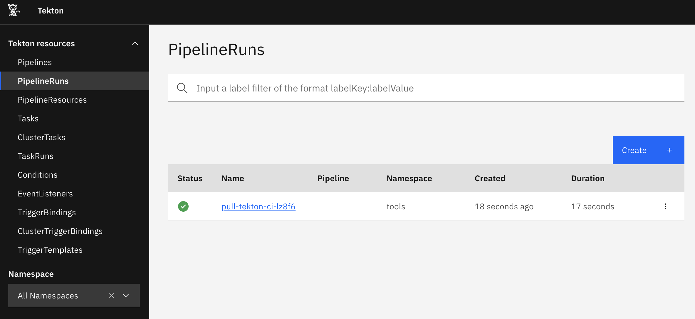
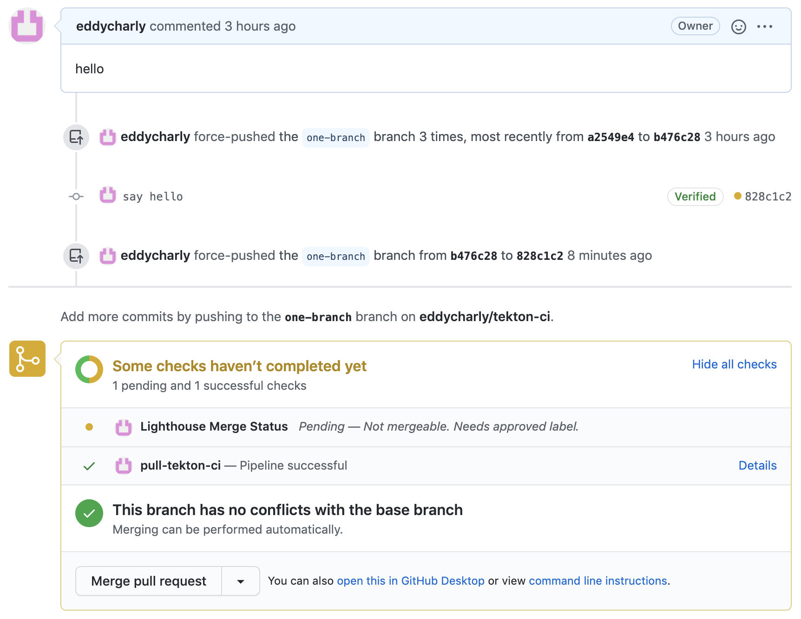

# Tekton Dashboard walkthrough - Lighthouse

This guide walks you through installing a working Tekton Dashboard locally from scratch and adding [Lighthouse](https://github.com/jenkins-x/Lighthouse) on top of it.
It covers the following topics:

* [Before you begin](#before-you-begin)
* [What is Lighthouse](#what-is-lighthouse)
* [Installing a working Tekton Dashboard locally from scratch](#installing-a-working-tekton-dashboard-locally-from-scratch)
* [Exposing your cluster ingress controller over ngrok](#exposing-your-cluster-ingress-controller-over-ngrok)
* [Creating a GitHub OAuth token](#creating-a-github-oauth-token)
* [Preparing your environment](#preparing-your-environment)
* [Installing Lighthouse](#installing-lighthouse)
* [Configuring Lighthouse](#configuring-Lighthouse)
* [Configuring GitHub to send events to Lighthouse](#configuring-github-to-send-events-to-lighthouse)
* [Configuring Lighthouse jobs](#configuring-lighthouse-jobs)
* [Lighthouse running jobs when opening a pull request](#lighthouse-running-jobs-when-opening-a-pull-request)
* [Cleaning up](#cleaning-up)

## Before you begin

Before you begin, make sure the following tools are installed:

1. [`kind`](https://kind.sigs.k8s.io/): For creating a local cluster running on top of docker.
1. [`kubectl`](https://kubernetes.io/docs/tasks/tools/install-kubectl/): For interacting with your kubernetes cluster.
1. [`helm`](https://helm.sh/docs/intro/install/): For installing helm charts in your kubernetes cluster.

You will also need a [GitHub](https://github.com/) account and a [ngrok](https://ngrok.com/) to complete this walkthrough.

## What is Lighthouse

From the [Lighthouse GitHub page](https://github.com/jenkins-x/lighthouse):

> Lighthouse is a lightweight ChatOps based webhook handler which can trigger Jenkins X Pipelines and Tekton Pipelines based on webhooks from multiple git providers such as: GitHub, GitHub Enterprise, BitBucket Server, GitLab

That is, Lighthouse brings ChatOps to a repository so that you can interact with a bot by writing comments on pull requests.

In addition, it receives webhooks and triggers jobs to be executed according to the received changes, it then reports the job execution status and can merge pull requests automatically when all jobs succeed.

Lighthouse is part of the jenkins-x platform but can be deployed stand-alone and plugged with Tekton pipelines easily.

## Installing a working Tekton Dashboard locally from scratch

If you didn't follow the [Tekton Dashboard walkthrough with Kind](./walkthrough-kind.md) yet, you should start there to get a local cluster with a working Tekton Dashboard installed.

The following steps will focus on getting Lighthouse installed and configured in your cluster to trigger `PipelineRun`s automatically when something happens on your GitHub repository.

## Exposing your cluster ingress controller over ngrok

In order to allow GitHub to send webhooks to your local cluster you will need to expose the ingress controller to the outside world.

You will use [ngrok](https://ngrok.com) free service to create a tunnel from `ngrok` to your local cluster. If you don't have an `ngrok` account please create a free account before continuing.

To expose your cluster ingress controller using `ngrok`, run the following command:

```bash
ngrok http 80
```

This should start `ngrok` and display something like:

```bash
Session Status                online                                                                                                                                                                                                                                            
Account                       eddycharly (Plan: Free)                                                                                                                                                                                                                           
Version                       2.3.35                                                                                                                                                                                                                                            
Region                        United States (us)                                                                                                                                                                                                                                
Web Interface                 http://127.0.0.1:4040                                                                                                                                                                                                                             
Forwarding                    http://683b6874e9b9.ngrok.io -> http://localhost:80                                                                                                                                                                                               
Forwarding                    https://683b6874e9b9.ngrok.io -> http://localhost:80                                                                                                                                                                                              
                                                                                                                                                                                                                                                                                
Connections                   ttl     opn     rt1     rt5     p50     p90                                                                                                                                                                                                       
                              1       0       0.00    0.00    75.24   75.24                                                                                                                                                                                                     
```

From the output above, `https://683b6874e9b9.ngrok.io` is the endpoint where GitHub can send events. You will use this endpoint to set up your Lighthouse ingress.

## Creating a GitHub OAuth token

Before installing Lighthouse, you will need to create an OAuth token on your GitHub account.

This OAuth token will be used by Lighthouse to perform various actions against your GitHub repository like merging pull requests, reporting job status or sending comments.

To create the OAuth token on GitHub, browse https://github.com/settings/tokens and click the `Generate new token` button.

Fill in the form and click the `Register token` button:
- `Note`: put whatever helps you remember how this token is used (`lighthouse` might be a good hint)
- tick the `repo` checkbox



Once the token is created, GitHub should show you the generated OAuth token, please note it as you will need it later to install and configure Lighthouse.



**NOTE:** for those curious people, this token is not valid anymore ;-)

## Preparing your environment

In this step you will define a few environment variables that will be reused in the other steps below.

These environment variables will hold information related to the GitHub org/repo you want to connect with Lighthouse and the necessary information to let Lighthouse authenticate with GitHub.

The variables, their use, and how to obtain them is detailed below:

| variable | use | provenance |
| -------- | --- | ---------- |
| USER | used by Lighthouse to interact with your repository | you know it |
| REPOSITORY | the repository you want to connect with Lighthouse and that will send events | you know it |
| OAUTH_TOKEN | the token used by Lighthouse to connect to your GitHub repository | you generated one in [Creating a GitHub OAuth token](#creating-a-github-oauth-token) |
| NGROK_ENDPOINT | the ngrok endpoint connected to your local cluster ingress controller | you obtained it when [Exposing your cluster ingress controller over ngrok](#exposing-your-cluster-ingress-controller-over-ngrok) |
| LIGHTHOUSE_NAMESPACE | the namespace where Lighthouse will be installed | you can choose whatever you want |
| HMAC_TOKEN | a secret that will be shared between Lighthouse and GitHub webhooks | you can choose whatever you want, generating a random secret is fine |

For example, with the GitHub user name being `eddycharly`, the repository to be used in this walkthrough being `tekton-ci`, from the steps above the script will be:

```bash
USER="eddycharly"
REPOSITORY="tekton-ci"
OAUTH_TOKEN="933b201f7b61fd82210786d715716e4a4c88ba72"
NGROK_ENDPOINT="683b6874e9b9.ngrok.io"
LIGHTHOUSE_NAMESPACE="tools"
# this will generate a random token
HMAC_TOKEN=$(LC_CTYPE=C tr -dc 'A-F0-9' < /dev/urandom | head -c42)
```

Please run the script above with your specific details before continuing.

## Installing Lighthouse

Now you have your [environement prepared](#preparing-your-environment), you can deploy [Lighthouse](https://github.com/jenkins-x/lighthouse) in your cluster.

You will install it using helm, the helm chart used in this guide is hosted on the [jenkins-x helm repository](http://chartmuseum.jenkins-x.io).

Add the jenkins-x helm repository by running the following command:

```bash
helm repo add jenkins-x http://chartmuseum.jenkins-x.io

helm repo update
```

To install the chart, run the command below (it will use the variables you defined when [preparing your environement](#preparing-your-environment)):

```bash
helm upgrade --install --wait --create-namespace --namespace $LIGHTHOUSE_NAMESPACE lighthouse jenkins-x/lighthouse --values - <<EOF
git:
  kind: github
  name: github
  server: https://github.com

user: $USER
oauthToken: $OAUTH_TOKEN
hmacToken: $HMAC_TOKEN

webhooks:
  replicaCount: 1
  ingress:
    enabled: true
    hosts:
      - $NGROK_ENDPOINT

engines:
  tekton: true

tektoncontroller:
  dashboardURL: 'http://tekton-dashboard.127.0.0.1.nip.io/'
EOF
```

At this point, Lighthouse should be running in your cluster, an ingress rule redirecting traffic from ngrok to Lighthouse should be setup, and ngrok should forward all traffic to your local cluster ingress controller.

## Configuring Lighthouse

Configuring Lighthouse is done through two configuration files `config.yaml` and `plugins.yaml`.

`config.yaml` contains the configuration used by Lighthouse and `plugins.yaml` contains the configuration related to plugins.

Configuring Lighthouse can be tricky, one approach is store config files in a git repository and use `config-updater` plugin to update the configuration when something changes in the repository.

In this walkthrough you will manage the config files yourself, there are plenty of simpler solutions for managing them, especially when using helm as a deployment tool.

Create the `config.yaml` and `plugins.yaml` files by running the commands below:

```bash
cat <<EOF > config.yaml
branch-protection:
  orgs: {}
  protect-tested-repos: true
github:
  LinkURL: null
owners_dir_excludes:
  default: null
  repos: null
pod_namespace: $LIGHTHOUSE_NAMESPACE
prowjob_namespace: $LIGHTHOUSE_NAMESPACE
push_gateway:
  serve_metrics: false
tide:
  context_options:
    from-branch-protection: true
    required-if-present-contexts: []
    skip-unknown-contexts: false
  merge_method: {}
  queries:
    - labels:
        - approved
      missingLabels:
        - do-not-merge
        - do-not-merge/hold
        - do-not-merge/work-in-progress
        - needs-ok-to-test
        - needs-rebase
      repos:
        - $USER/$REPOSITORY
EOF
```

```bash
cat <<EOF > plugins.yaml
approve:
  - lgtm_acts_as_approve: true
    repos:
      - $USER/$REPOSITORY
    require_self_approval: true
blunderbuss: {}
cat: {}
cherry_pick_unapproved: {}
config_updater:
  gzip: false
  maps: {}
external_plugins: {}
heart: {}
label:
  additional_labels: null
owners: {}
plugins:
  $USER/$REPOSITORY:
  - approve
  - trigger
requiresig: {}
sigmention: {}
size:
  l: 0
  m: 0
  s: 0
  xl: 0
  xxl: 0
slack: {}
triggers: []
welcome:
  - message_template: Welcome
EOF
```

Once these two files are created you will need to update your Lighthouse deployment using helm by running the command below:

```bash
helm upgrade --install --wait --create-namespace --namespace $LIGHTHOUSE_NAMESPACE lighthouse jenkins-x/lighthouse \
  --set configMaps.create=true \
  --set-file configMaps.config=./config.yaml \
  --set-file configMaps.plugins=./plugins.yaml \
  --values - <<EOF
git:
  kind: github
  name: github
  server: https://github.com

user: $USER
oauthToken: $OAUTH_TOKEN
hmacToken: $HMAC_TOKEN

webhooks:
  replicaCount: 1
  ingress:
    enabled: true
    hosts:
      - $NGROK_ENDPOINT

engines:
  tekton: true

tektoncontroller:
  dashboardURL: 'http://tekton-dashboard.127.0.0.1.nip.io/'
EOF
```

Remember to update the Lighthouse deployment each time you modiify the `config.yaml` or `plugins.yaml` file.

Those two files are enough to get Lighthouse running in the context of this walkthrough.
However, you can tweak the content to get the behaviour that suits your needs, please refer to the [config](https://github.com/jenkins-x/lighthouse/blob/master/docs/config/Lighthouse%20config.md) and [plugins](https://github.com/jenkins-x/lighthouse/blob/master/docs/PLUGINS.md) documentation.

Next step is to configure GitHub to send events for your repository to Lighthouse.

## Configuring GitHub to send events to Lighthouse

To configure GitHub to send events to Lighthouse, you need to add the Lighthouse endpoint in the webhooks configuration of your repository.

You will need to go in the repositoy `Settings`, under the `Webhooks` tab, click the `Add webhook` button, fill in the form and click the `Add webhook` button:
- `Payload URL`: set it to the https `ngrok` endpoint under `/hook` path
- `Content type`: should be `application/json`
- `Secret`: this is the `HMAC_TOKEN` environment variable you configured when [preparing your environement](#preparing-your-environment) (run `echo $HMAC_TOKEN` if you generated randomly)
- `Which events would you like to trigger this webhook?`: select the `Send me everything` option



## Configuring Lighthouse jobs

Lighthouse jobs are configured using a centralized approach where jobs are defined in the `config.yaml` file.

There are two main categories of jobs: `presubmits` that run against pull requests, and `postsubmits` that run against pushes.

The `config.yaml` contains `presubmits` and `postsubmits` job definitions for every repository that sends notifications.

In the example below, there is one `presubmit` job that takes the repository and executes an `ls -al` command in it. Execute the following command to create the corresponding `config.yaml` file:

```bash
cat <<EOF > config.yaml
# this is where presubmit jobs are defined
presubmits:
  $USER/$REPOSITORY:
    - name: pull-$REPOSITORY
      agent: tekton-pipeline
      always_run: true
      rerun_command: '/test pull-$REPOSITORY'
      trigger: '(?m)^/test pull-$REPOSITORY,?(\\s+|$)'
      pipeline_run_spec:
        workspaces:
          - name: shared-data
            volumeClaimTemplate:
              spec:
                accessModes:
                  - ReadWriteOnce
                resources:
                  requests:
                    storage: 10M
        pipelineSpec:
          params:
            - name: url
              type: string
            - name: revision
              type: string
            - name: batchedRefs
              type: string
          workspaces:
            - name: shared-data
          tasks:
            - name: git-batch-merge
              workspaces:
                - name: output
                  workspace: shared-data
              taskRef:
                name: git-batch-merge
              params:
                - name: url
                  value: \$(params.url)
                - name: revision
                  value: \$(params.revision)
                - name: batchedRefs
                  value: \$(params.batchedRefs)
            - name: ls-al
              runAfter:
                - git-batch-merge
              workspaces:
                - name: source
                  workspace: shared-data
              taskSpec:
                workspaces:
                  - name: source
                steps:
                  - name: ls-al
                    image: ubuntu
                    script: |
                      #!/usr/bin/env bash
                      ls -al \$(workspaces.source.path)
# this is where postsubmit jobs are defined
postsubmits: {}
# the configuration below doesn't change
branch-protection:
  orgs: {}
  protect-tested-repos: true
github:
  LinkURL: null
owners_dir_excludes:
  default: null
  repos: null
pod_namespace: $LIGHTHOUSE_NAMESPACE
prowjob_namespace: $LIGHTHOUSE_NAMESPACE
push_gateway:
  serve_metrics: false
tide:
  context_options:
    from-branch-protection: true
    required-if-present-contexts: []
    skip-unknown-contexts: false
  merge_method: {}
  queries:
    - labels:
        - approved
      missingLabels:
        - do-not-merge
        - do-not-merge/hold
        - do-not-merge/work-in-progress
        - needs-ok-to-test
        - needs-rebase
      repos:
        - $USER/$REPOSITORY
EOF
```

**NOTES:** the Lighthouse Tekton controller listens in the deployed namespace so `pod_namespace` and `prowjob_namespace` must be set to the namespace where Lighthouse was deployed.

This job uses the [git-batch-merge task](https://github.com/tektoncd/catalog/tree/master/task/git-batch-merge/0.2), apply this task in your cluster by running:

```bash
kubectl apply -n $LIGHTHOUSE_NAMESPACE -f https://raw.githubusercontent.com/tektoncd/catalog/master/task/git-batch-merge/0.2/git-batch-merge.yaml
```

To terminate the configuration, update the Lighthouse deployment with the new `config.yaml` file:

```bash
helm upgrade --install --wait --create-namespace --namespace $LIGHTHOUSE_NAMESPACE lighthouse jenkins-x/lighthouse \
  --set configMaps.create=true \
  --set-file configMaps.config=./config.yaml \
  --set-file configMaps.plugins=./plugins.yaml \
  --values - <<EOF
git:
  kind: github
  name: github
  server: https://github.com

user: $USER
oauthToken: $OAUTH_TOKEN
hmacToken: $HMAC_TOKEN

webhooks:
  replicaCount: 1
  ingress:
    enabled: true
    hosts:
      - $NGROK_ENDPOINT

engines:
  tekton: true

tektoncontroller:
  dashboardURL: 'http://tekton-dashboard.127.0.0.1.nip.io/'
EOF
```

## Lighthouse running jobs when opening a pull request

Pull requests opened on your repository will now send events to Lighthouse, Lighthouse will trigger the `PipelineRun`s defined in the `presubmit` jobs for the given repository. You can browse the Tekton Dashboard at `http://tekton-dashboard.127.0.0.1.nip.io/`.



**The job status will be reported to GitHub**



**Once all jobs succeed Lighthouse can merge your pull request**

Posting `/approve` in the pull request comments will add the `approved` label to the pull request and Lighthouse will merge the PR.

**Different plugins bring different functionality**

The Lighthouse functionality is plugin driven. You can add/remove functionality by changing the `plugins.yaml` file, configuring plugins and enabling them for individual repositories.

You can read more about the Lighthouse configuration options on the [Lighthouse GitHub page](https://github.com/jenkins-x/lighthouse).

## Cleaning up

Delete the GitHub Oauth token you created for this walkthrough.

Remove the webhooks from your GitHub repository.

Turn off the ngrok tunnel.

To clean up the local kind cluster, follow the [cleaning up instructions](./walkthrough-kind.md#cleaning-up) in Tekton Dashboard walkthrough with Kind.

---

Except as otherwise noted, the content of this page is licensed under the [Creative Commons Attribution 4.0 License](https://creativecommons.org/licenses/by/4.0/).

Code samples are licensed under the [Apache 2.0 License](https://www.apache.org/licenses/LICENSE-2.0).
