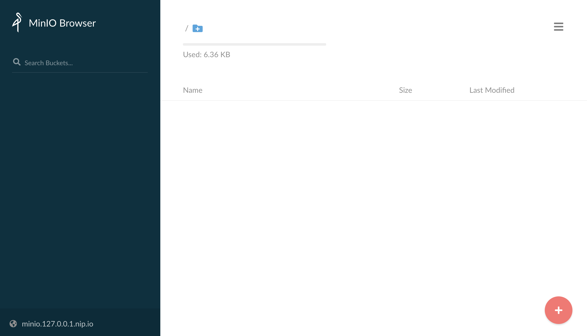
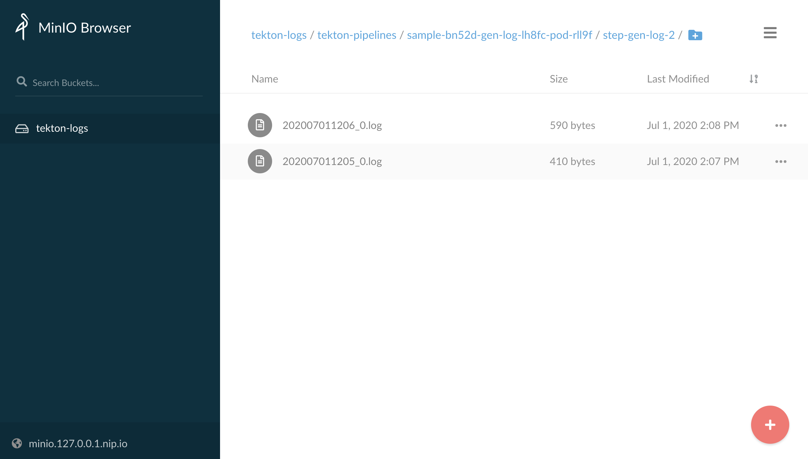
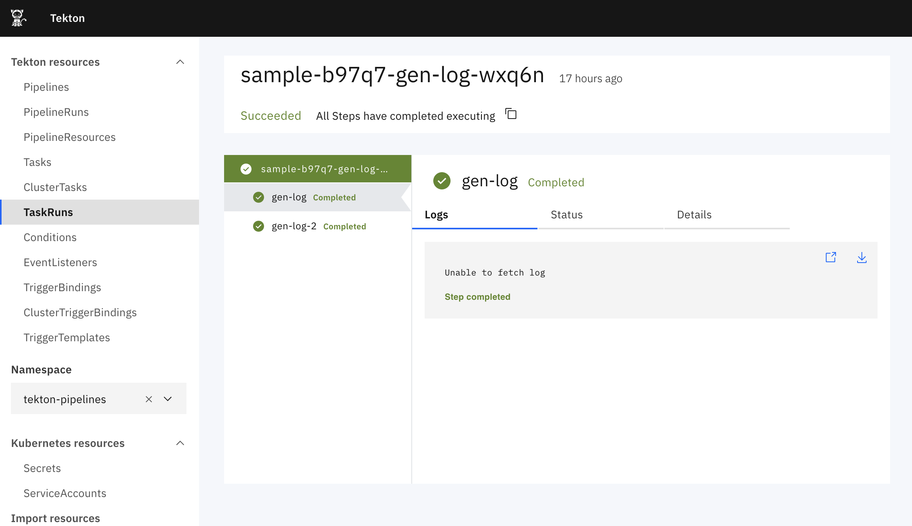
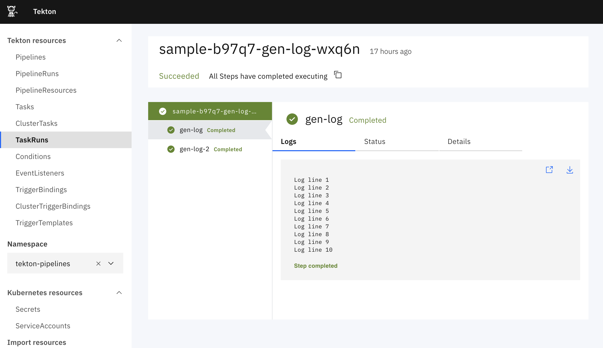

# Tekton Dashboard walkthrough - Logs persistence

This guide walks you through installing a working Tekton Dashboard locally from scratch, collecting logs into an object storage solution like AWS S3, exposing those logs through a service and setting up the Tekton Dashboard to fallback on this service when the logs have been garbage collected by the cluster. It covers the following topics:

* [Before you begin](#before-you-begin)
* [Overview](#overview)
* [Installing a working Tekton Dashboard locally from scratch](#installing-a-working-tekton-dashboard-locally-from-scratch)
* [Installing minio as an object storage solution](#installing-minio-as-an-object-storage-solution)
* [Collecting TaskRuns pod logs](#collecting-taskruns-pod-logs)
* [Creating a service to serve collected logs](#creating-a-service-to-serve-collected-logs)
* [Setting up the Dashboard logs fallback](#setting-up-the-dashboard-logs-fallback)
* [Cleaning up](#cleaning-up)

## Before you begin

Before you begin, make sure the following tools are installed:

1. [`kind`](https://kind.sigs.k8s.io/): For creating a local cluster running on top of docker.
1. [`kubectl`](https://kubernetes.io/docs/tasks/tools/install-kubectl/): For interacting with your kubernetes cluster.
1. [`helm`](https://helm.sh/docs/intro/install/): For installing helm charts in your kubernetes cluster.

## Overview

In this walkthrough you will deploy [minio](https://min.io), an object storage solution that can be accessed like AWS S3 or other cloud providers APIs.

You will use this object storage to store pod logs collected with [banzaicloud logging operator](https://github.com/banzaicloud/logging-operator) from your `TaskRun`s.

Then, you will create a service to serve those logs and will plug the Tekton Dashboard to fallback to this service when the logs you're trying to view have been garbage collected and are not available anymore from the kubernetes API.

## Installing a working Tekton Dashboard locally from scratch

If you didn't follow the [Tekton Dashboard walkthrough with Kind](./walkthrough-kind.md) yet, start there to get a local cluster with a working Tekton Dashboard installed.

The following steps will focus on collecting, storing and serving pod logs to finally plug the logs service on the Tekton Dashboard.

## Installing minio as an object storage solution

First, you will need to deploy a storage solution to store the collected logs. For that, you're going to deploy [minio](https://min.io), it exposes the same API as AWS S3.

Note that `minio` exposes other APIs similar to other cloud storage providers too.

To deploy `minio` in your cluster, run the following command to install the `minio` helm chart:

```bash
helm repo add minio https://helm.min.io/

helm repo update

helm upgrade --install --version 8.0.9 --wait --create-namespace --namespace tools minio minio/minio --values - <<EOF
nameOverride: minio
fullnameOverride: minio

persistence:
  enabled: false

accessKey: "ACCESSKEY"
secretKey: "SECRETKEY"

ingress:
  enabled: true
  hosts:
    - minio.127.0.0.1.nip.io

resources:
  requests:
    memory: 100M
EOF
```

The deployed instance will use hard coded access and secret keys `ACCESSKEY` / `SECRETKEY` and the service will be exposed externally at `http://minio.127.0.0.1.nip.io`.

For this walkthrough `minio` will use in-memory storage but you can enable persistent storage by changing the config.

The `minio` dashboard is available at the URL `http://minio.127.0.0.1.nip.io`.



## Collecting TaskRuns pod logs

Now you have a running storage, you can start collecting logs from the pods baking your `TaskRun`s and store those logs in `minio`.

To collect logs, you will install [banzaicloud logging operator](https://github.com/banzaicloud/logging-operator). The `logging operator` makes it easy to deploy a fluentd/fluentbit combo for streaming logs to a destination of your choice.

First, deploy the logging operator by running the following commands:

```bash
helm repo add banzaicloud-stable https://kubernetes-charts.banzaicloud.com

helm repo update

helm upgrade --install --version 3.6.0 --wait --create-namespace --namespace tools logging-operator banzaicloud-stable/logging-operator --set createCustomResource=false
```

**NOTE**: This will install `logging-operator` version `3.6.0`, there was a [breaking change](https://github.com/banzaicloud/logging-operator/releases/tag/3.6.0) in this release. The walkthrough will not work with earlier versions.

To start collecting logs you will need to create the logs pipeline using the available CRDs:

- `Logging` will deploy the necessary fluentd/fluentbit workloads:

```bash
kubectl -n tools apply -f - <<EOF
apiVersion: logging.banzaicloud.io/v1beta1
kind: Logging
metadata:
  name: logging
spec:
  fluentd: {}
  fluentbit: {}
  controlNamespace: tools
EOF
```

This is a very simple deployment, please note that the position database and buffer volumes are ephemeral, this will stream logs again if pods restart.

- `ClusterOutput` defines the output of the logs pipeline. In our case AWS S3 (through `minio`):

```bash
kubectl -n tools apply -f - <<EOF
apiVersion: logging.banzaicloud.io/v1beta1
kind: ClusterOutput
metadata:
  name: s3
spec:
  s3:
    aws_key_id:
      value: ACCESSKEY
    aws_sec_key:
      value: SECRETKEY
    s3_endpoint: http://minio.tools.svc.cluster.local:9000
    s3_bucket: tekton-logs
    s3_region: tekton
    force_path_style: 'true'
    store_as: text
    path: \${\$.kubernetes.namespace_name}/\${\$.kubernetes.pod_name}/\${\$.kubernetes.container_name}/
    s3_object_key_format: '%{path}%{time_slice}_%{index}.log'
    buffer:
      tags: time,\$.kubernetes.namespace_name,\$.kubernetes.pod_name,\$.kubernetes.container_name
      timekey: 1m
      timekey_wait: 1m
      timekey_use_utc: true
    format:
      type: single_value
      message_key: message
EOF
```

The `ClusterOutput` above will stream logs to our `minio` storage in a `tekton-logs` bucket. It will buffer logs and will store one file per minute in the `<namespace_name>/<pod_name>/<container_name>/` path. All metadata will be omitted and only the log message will be stored, it will be the raw pod logs.

- `ClusterFlow` defines how the collected logs are dispatched to the outputs:

```bash
kubectl -n tools apply -f - <<EOF
apiVersion: logging.banzaicloud.io/v1beta1
kind: ClusterFlow
metadata:
  name: flow
spec:
  globalOutputRefs:
    - s3
  match:
    - select:
        labels:
          app.kubernetes.io/managed-by: tekton-pipelines
EOF
```

The `ClusterFlow` above takes all logs from pods that have the `app.kubernetes.io/managed-by: tekton-pipelines` label (those are the pods baking `TaskRun`s) and dispatches them to the `ClusterOutput` created in the previous step.

Running the `PipelineRun` below produces logs and you will see corresponding objects being added in `minio` as logs are collected and stored by the logs pipeline.

```bash
kubectl -n tekton-pipelines create -f - <<EOF
apiVersion: tekton.dev/v1beta1
kind: PipelineRun
metadata:
  generateName: sample-
spec:
  pipelineSpec:
    tasks:
      - name: gen-log
        taskSpec:
          steps:
            - name: gen-log
              image: ubuntu
              script: |
                #!/usr/bin/env bash
                for i in {1..10}
                do
                  echo "Log line \$i"
                  sleep 1s
                done
            - name: gen-log-2
              image: ubuntu
              script: |
                #!/usr/bin/env bash
                for i in {1..100}
                do
                  echo "Log line \$i"
                  sleep 1s
                done
EOF
```



## Creating a service to serve collected logs

Now pod logs are collected and stored in your object storage, you will create a service to serve those logs.

Given a `namespace`, `pod` and `container`, the service will list files from s3, then stream the content of those files to serve logs to the caller.

Run the command below to create the kubernetes `Deployment` to serve your logs:

```bash
kubectl apply -n tools -f - <<EOF
apiVersion: apps/v1
kind: Deployment
metadata:
  name: logs-server
  labels: 
    app: logs-server
spec:
  replicas: 1
  selector:
    matchLabels:
      app: logs-server
  template:
    metadata:
      labels:
        app: logs-server
    spec:
      containers:
      - name: node
        image: node:14
        ports:
        - containerPort: 3000
        command:
        - bash
        args:
        - -c
        - |
          cat <<EOF > server.js
          const express = require('express');
          const aws = require('aws-sdk');

          aws.config.update({
            endpoint: 'minio.tools.svc.cluster.local:9000',
            accessKeyId: 'ACCESSKEY',
            secretAccessKey: 'SECRETKEY',
            region: 'tekton',
            s3ForcePathStyle: true,
            sslEnabled: false
          });

          const s3 = new aws.S3();
          const app = express();

          const bucket = 'tekton-logs'

          function streamLogs(namespace, pod, container, response) {
            s3.listObjects({ Bucket: bucket, Delimiter: '', Prefix: namespace+'/'+pod+'/'+container+'/' })
              .promise()
              .then(files =>
                files.Contents.sort((a, b) => a.Key.localeCompare(b.Key)).reduce((acc, file) =>
                  acc.then(() =>
                    new Promise(fulfill =>
                      s3.getObject({Bucket: bucket, Key: file.Key})
                        .createReadStream()
                        .on("finish", fulfill)
                        .pipe(response, { end: false })
                    )
                  ),
                  Promise.resolve()
                )
              )
              .then(() => response.end());
          }
          app.get('/logs/:namespace/:pod/:container', (req, res) => streamLogs(req.params.namespace, req.params.pod, req.params.container, res));
          app.listen(3000, '0.0.0.0');
          EOF

          npm install aws-sdk@2.748.0 express@4.17.1

          node ./server.js
EOF
```

This deployment will start a container running `nodejs`. It will install `express` web server and `aws-sdk` to interact with S3 (configured to hit your `minio` endpoint).

Then it will run a web server exposing the `'/logs/:namespace/:pod/:container'` route to serve logs fetched from s3.

To make this available you will need to deploy a `Service` and an `Ingress` rule to expose the `Deployment`:

```bash
kubectl apply -n tools -f - <<EOF
kind: Service
apiVersion: v1
metadata:
  name: logs-server
  labels:
    app: logs-server
spec:
  ports:
  - port: 3000
    targetPort: 3000
  selector:
    app: logs-server
---
apiVersion: networking.k8s.io/v1
kind: Ingress
metadata:
  name: tekton-logs
spec:
  rules:
  - host: logs.127.0.0.1.nip.io
    http:
      paths:
      - pathType: ImplementationSpecific
        backend:
          service:
            name: logs-server
            port:
              number: 3000
EOF
```

The logs server is available at `http://logs.127.0.0.1.nip.io`.

## Setting up the Dashboard logs fallback

The last step in this walkthrough is to setup the Tekton Dashboard to use the logs server you created above. The logs server will act as a fallback when the logs are not available anymore because the underlying pods baking `TaskRun`s are gone away.

First, delete the pods for your `TaskRun`s so that the Dashboard backend can't find the pod logs:

```bash
kubectl delete pod -l=app.kubernetes.io/managed-by=tekton-pipelines -n tekton-pipelines
```

The Dashboard displays the `Unable to fetch logs` message when browsing tasks.



Second, patch the Dashboard deployment to add the `--external-logs=http://logs-server.tools.svc.cluster.local:3000/logs` option:

```bash
kubectl patch deployment tekton-dashboard -n tekton-pipelines --type='json' \
  --patch='[{"op": "add", "path": "/spec/template/spec/containers/0/args/-", "value": "--external-logs=http://logs-server.tools.svc.cluster.local:3000/logs"}]'
```

The logs are now displayed again, fetched from the logs server configured in the previous steps.



**NOTE:** Alternatively you can use the `--external-logs` argument when invoking the `installer` script:

```bash
curl -sL https://raw.githubusercontent.com/tektoncd/dashboard/main/scripts/release-installer | \
   bash -s -- install latest --external-logs http://logs-server.tools.svc.cluster.local:3000/logs

kubectl wait -n tekton-pipelines \
  --for=condition=ready pod \
  --selector=app.kubernetes.io/part-of=tekton-dashboard,app.kubernetes.io/component=dashboard \
  --timeout=90s
```

## Cleaning up

To clean up the local kind cluster, follow the [cleaning up instructions](./walkthrough-kind.md#cleaning-up) in Tekton Dashboard walkthrough with Kind.

---

Except as otherwise noted, the content of this page is licensed under the [Creative Commons Attribution 4.0 License](https://creativecommons.org/licenses/by/4.0/).

Code samples are licensed under the [Apache 2.0 License](https://www.apache.org/licenses/LICENSE-2.0).
