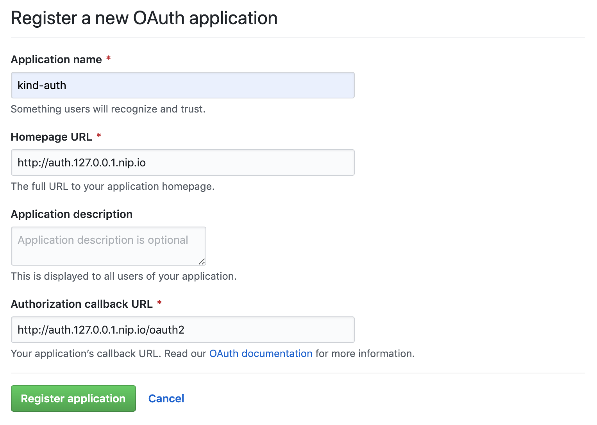

# Tekton Dashboard walkthrough - OAuth2 Proxy

This guide walks you through installing a working Tekton Dashboard locally from scratch and securing it behind an oauth2 proxy. It covers the following topics:

* [Before you begin](#before-you-begin)
* [Overview](#overview)
* [Installing a working Tekton Dashboard locally from scratch](#installing-a-working-tekton-dashboard-locally-from-scratch)
* [Creating a GitHub OAuth App](#creating-a-github-oauth-app)
* [Installing and configuring oauth2-proxy](#installing-and-configuring-oauth2-proxy)
* [Setting up Dashboard Ingress rule for authentication](#setting-up-dashboard-ingress-rule-for-authentication)
* [Configuring Dashboard logout URL](#configuring-dashboard-logout-url)
* [Cleaning up](#cleaning-up)

## Before you begin

Before you begin, make sure the following tools are installed:

1. [`kind`](https://kind.sigs.k8s.io/): For creating a local cluster running on top of docker.
1. [`kubectl`](https://kubernetes.io/docs/tasks/tools/install-kubectl/): For interacting with your kubernetes cluster.
1. [`helm`](https://helm.sh/docs/intro/install/): For installing helm charts in your kubernetes cluster.

You will also need a [GitHub](https://github.com/) account to complete this walkthrough.

## Overview

In this walkthrough you will deploy a centralized `oauth2-proxy` service to authenticate from a GitHub OAuth application.

You will then use this authentication service to secure the Tekton Dashboard ingress by letting `NGINX ingress controller` know that the ingress requires authentication and how to authenticate against the `oauth2-proxy` service.

Please note that the `oauth2-proxy` service could be used with any ingress in your cluster, it is not limited to the Tekton Dashboard, that's why it's called centralized.

The picture below illustrates the deployed components and interactions between them:


## Installing a working Tekton Dashboard locally from scratch

If you didn't follow the [Tekton Dashboard walkthrough with Kind](./walkthrough-kind.md) yet, start there to get a local cluster with a working Tekton Dashboard installed.

The following steps will focus on getting `oauth2-proxy` installed in your cluster and securing the Tekton Dashboard `Ingress`.

## Creating a GitHub OAuth App

Before installing `oauth2-proxy`, you will need to create a OAuth App on your GitHub account.

This OAuth App will be used to authenticate users using GitHub.

To create the OAuth App on GitHub, browse https://github.com/settings/developers and click the `New OAuth App` button.

Fill in the form and click the `Register application` button:
- `Application name`: the name of the application
- `Homepage URL`: Set this to `http://auth.127.0.0.1.nip.io` but this in not important
- `Authorization callback URL`: Set this to `http://auth.127.0.0.1.nip.io/oauth2`, we will expose `oauth2-proxy` under this URL in the next step



Once the application is registered, you will obtain a `Client ID` and `Client Secret`.

These will be needed to configure `oauth2-proxy` in the next step.


## Installing and configuring oauth2-proxy

Now you have the OAuth application created on GitHub, you can deploy [oauth2-proxy](https://github.com/oauth2-proxy/oauth2-proxy) in your cluster.

You will install it using helm. The helm chart used in this guide is hosted on the [helm official repository](https://github.com/helm/charts/tree/master/stable/oauth2-proxy).

To install the chart, set the `Client ID` and `Client Secret` you obtained from GitHub and run the command below:

```bash
# CLIENT_ID and CLIENT_SECRET are the Client ID and Client Secret obtained
# when creating the GitHub OAuth application in the previous step
CLIENT_ID=__THE_CLIENT_ID_OF_YOUR_GITHUB_OAUTH_APP__
CLIENT_SECRET=__THE_CLIENT_SECRET_OF_YOUR_GITHUB_OAUTH_APP__

helm upgrade --install --wait --create-namespace --namespace tools oauth2-proxy stable/oauth2-proxy --values - <<EOF
config:
  clientID: $CLIENT_ID
  clientSecret: $CLIENT_SECRET

extraArgs:
  provider: github
  whitelist-domain: .127.0.0.1.nip.io
  cookie-domain: .127.0.0.1.nip.io
  redirect-url: http://auth.127.0.0.1.nip.io/oauth2/callback
  cookie-secure: 'false'

ingress:
  enabled: true
  path: /
  hosts:
    - auth.127.0.0.1.nip.io
EOF
```

This will install `oauth2-proxy` in your cluster in the `tools` namespace.

Explanation of the parameters:
- `config.clientID` and `config.clientSecret` are obtained when creating the GitHub OAuth application
- `extraArgs.provider` tells `oauth2-proxy` to use GitHub
- `extraArgs.redirect-url` is needed for HTTP callbacks, `oauth2-proxy` will default to HTTPS if not set
- `extraArgs.whitelist-domain` allows `oauth2-proxy` to authenticate request for all `.127.0.0.1.nip.io` subdomains
- `extraArgs.cookie-secure` disables CSRF as we are using HTTP (not HTTPS)
- `extraArgs.cookie-domain` is used to set the cookie for all `.127.0.0.1.nip.io` subdomains. As `oauth2-proxy` is deployed centrally, it will be exposed at `http://auth.127.0.0.1.nip.io` while the dashboard will be exposed at `http://tekton-dashboard.127.0.0.1.nip.io`. The cookie needs to be available to both URLs

Although not used in this walkthrough, the GitHub provider supports restricting logins to members of an organisation, members of a team, or collaborators of a repository for more security.

For the full list of configuration options and other supported providers see the [oauth2-proxy documentation](https://oauth2-proxy.github.io/oauth2-proxy/docs/).

## Setting up Dashboard Ingress rule for authentication

With `oauth2-proxy` deployed, you will now secure the Tekton Dashboard `Ingress`.

To do so, you need to add [annotations on the ingress](https://github.com/kubernetes/ingress-nginx/blob/master/docs/user-guide/nginx-configuration/annotations.md#external-authentication) to let `NGINX ingress controller` know that the ingress requires authentication and how to authenticate.

Two annotations are used here:
- `nginx.ingress.kubernetes.io/auth-url` indicates that the ingress uses an external service that provides authentication. This will point to the `oauth2-proxy` service
- `nginx.ingress.kubernetes.io/auth-signin` indicates the URL used to sign in when the user is not logged in. This will point to `oauth2-proxy` sign in endpoint, setting the desired redirect URL in the query parameters so that users are redirected to the Tekton Dashboard after logging in

To apply the ingress annotations run the command below:

```bash
kubectl apply -n tekton-pipelines -f - <<EOF
apiVersion: networking.k8s.io/v1
kind: Ingress
metadata:
  name: tekton-dashboard
  annotations:
    nginx.ingress.kubernetes.io/auth-url: "http://oauth2-proxy.tools.svc.cluster.local/oauth2/auth"
    nginx.ingress.kubernetes.io/auth-signin: "http://auth.127.0.0.1.nip.io/oauth2/sign_in?rd=http://\$host\$request_uri"
spec:
  rules:
  - host: tekton-dashboard.127.0.0.1.nip.io
    http:
      paths:
      - pathType: ImplementationSpecific
        backend:
          service:
            name: tekton-dashboard
            port:
              number: 9097
EOF
```

**NOTE:** The URL set in the `nginx.ingress.kubernetes.io/auth-url` is the in-cluster DNS name of the `oauth2-proxy` service. We can't use `auth.127.0.0.1.nip.io` here because it resolves to `127.0.0.1` and therefore the ingress controller would call itself instead of the `oauth2-proxy` service.

Visiting the Tekton Dashboard URL `http://tekton-dashboard.127.0.0.1.nip.io` for the first time redirects you to the `oauth2-proxy` sign in page (`http://auth.127.0.0.1.nip.io/oauth2/sign_in?rd=http://tekton-dashboard.127.0.0.1.nip.io/`):


Clicking on the `Sign in with GitHub` button sends you to the GitHub OAuth sign in page:


Finally, authorizing the connection brings you back to the Tekton Dashboard.

## Configuring Dashboard logout URL

To configure the Dashboard logout URL, pass the `--logout-url http://auth.127.0.0.1.nip.io/oauth2/sign_out` argument to the `release-installer` script:

```bash
curl -sL https://raw.githubusercontent.com/tektoncd/dashboard/main/scripts/release-installer | \
   bash -s -- install latest --logout-url http://auth.127.0.0.1.nip.io/oauth2/sign_out

kubectl wait -n tekton-pipelines \
  --for=condition=ready pod \
  --selector=app.kubernetes.io/part-of=tekton-dashboard,app.kubernetes.io/component=dashboard \
  --timeout=90s
```

## Cleaning up

Delete the GitHub Oauth application you created for this walkthrough.

To clean up the local kind cluster, follow the [cleaning up instructions](./walkthrough-kind.md#cleaning-up) in Tekton Dashboard walkthrough with Kind.

---

Except as otherwise noted, the content of this page is licensed under the [Creative Commons Attribution 4.0 License](https://creativecommons.org/licenses/by/4.0/).

Code samples are licensed under the [Apache 2.0 License](https://www.apache.org/licenses/LICENSE-2.0).
